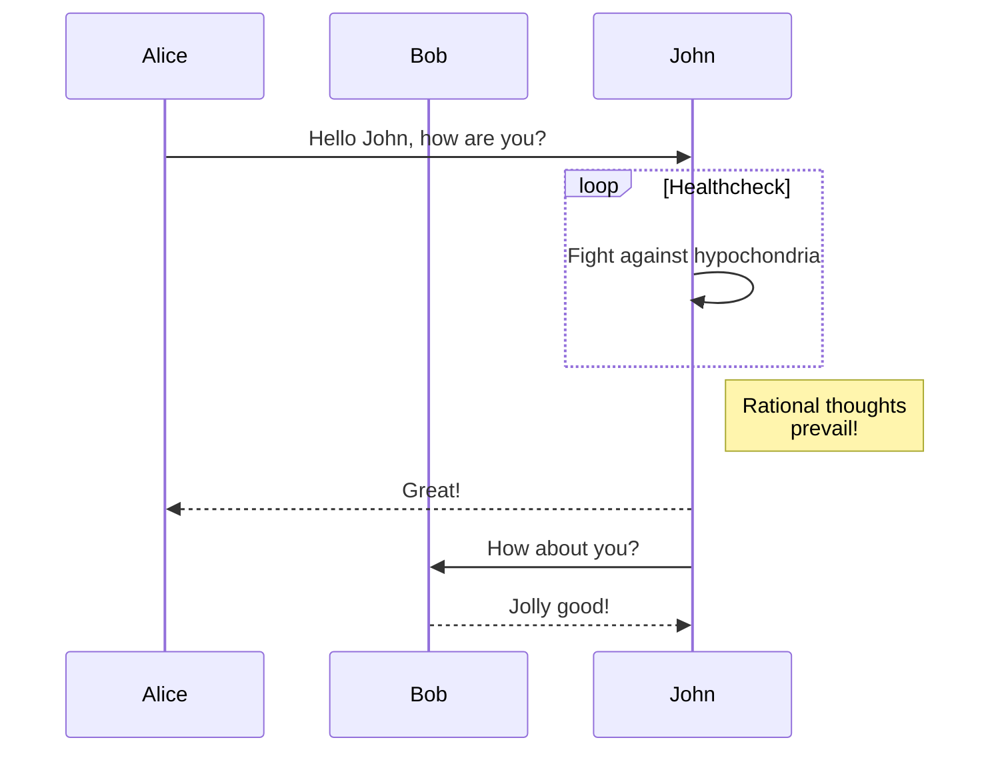
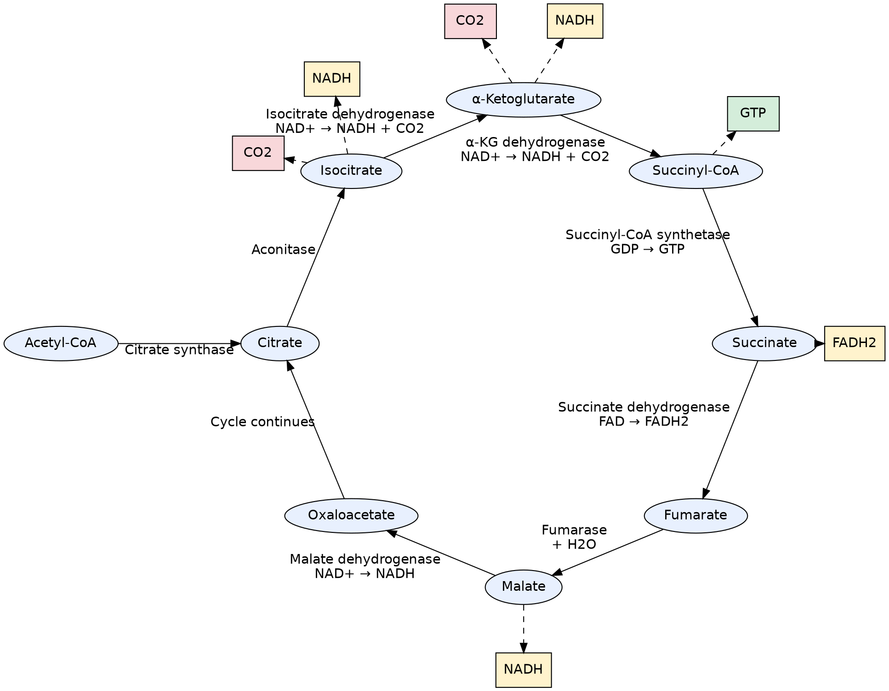

<!--more-->

## Mermaid

```mermaid
sequenceDiagram
    participant Alice
    participant Bob
    Alice->>John: Hello John, how are you?
    loop Healthcheck
        John->>John: Fight against hypochondria
    end
    Note right of John: Rational thoughts <br/>prevail!
    John-->>Alice: Great!
    John->>Bob: How about you?
    Bob-->>John: Jolly good!
```

## MathJax

\[
a^2 + b^2 = c^2\,.
\]

$$
\ce{Hg^2+ ->[I-] HgI2 ->[I-] [Hg^{II}I4]^2-}
$$

## Graphviz

```graphviz
digraph TCA {
    layout=circo;
    overlap=false;
    splines=true;

    node [shape=ellipse, style=filled, fillcolor="#E8F0FE", fontname="Helvetica"];

    A [label="Acetyl-CoA"];
    B [label="Citrate"];
    C [label="Isocitrate"];
    D [label="α-Ketoglutarate"];
    E [label="Succinyl-CoA"];
    F [label="Succinate"];
    G [label="Fumarate"];
    H [label="Malate"];
    I [label="Oxaloacetate"];

    edge [fontname="Helvetica"];

    A -> B [label="Citrate synthase"];
    B -> C [label="Aconitase"];
    C -> D [label="Isocitrate dehydrogenase\nNAD+ → NADH + CO2"];
    D -> E [label="α-KG dehydrogenase\nNAD+ → NADH + CO2"];
    E -> F [label="Succinyl-CoA synthetase\nGDP → GTP"];
    F -> G [label="Succinate dehydrogenase\nFAD → FADH2"];
    G -> H [label="Fumarase\n+ H2O"];
    H -> I [label="Malate dehydrogenase\nNAD+ → NADH"];
    I -> B [label="Cycle continues"];

    // 辅助节点（能量分子）
    NADH1 [label="NADH", shape=box, fillcolor="#FFF3CD"];
    NADH2 [label="NADH", shape=box, fillcolor="#FFF3CD"];
    NADH3 [label="NADH", shape=box, fillcolor="#FFF3CD"];
    FADH2 [label="FADH2", shape=box, fillcolor="#FFF3CD"];
    GTP [label="GTP", shape=box, fillcolor="#D4EDDA"];
    CO2_1 [label="CO2", shape=box, fillcolor="#F8D7DA"];
    CO2_2 [label="CO2", shape=box, fillcolor="#F8D7DA"];

    // 虚线连接（表示生成）
    C -> NADH1 [style=dashed];
    D -> NADH2 [style=dashed];
    H -> NADH3 [style=dashed];
    F -> FADH2 [style=dashed];
    E -> GTP [style=dashed];

    C -> CO2_1 [style=dashed];
    D -> CO2_2 [style=dashed];
}
```
