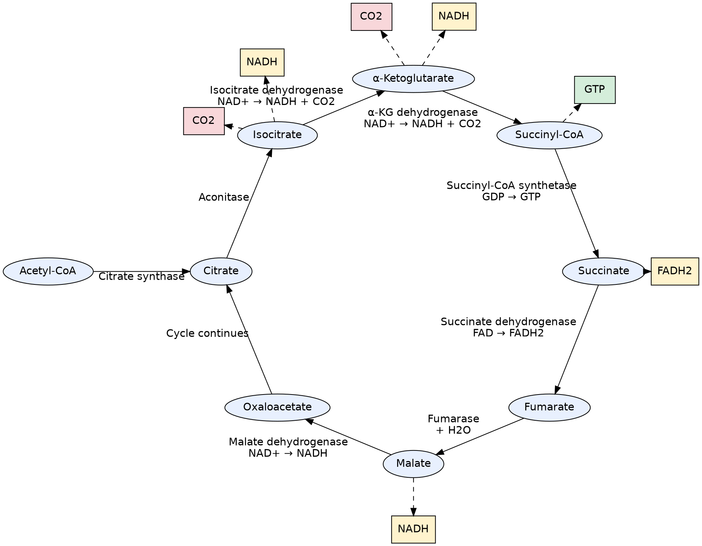

<!--more-->

```mermaid
flowchart LR
    A[Acetyl-CoA (2C)] -->|+ Oxaloacetate (4C)\nCitrate Synthase| B[Citrate (6C)]
    B -->|Aconitase| C[Isocitrate (6C)]
    C -->|Isocitrate Dehydrogenase\nNAD+ → NADH + CO₂| D[α-Ketoglutarate (5C)]
    D -->|α-Ketoglutarate Dehydrogenase\nNAD+ → NADH + CO₂| E[Succinyl-CoA (4C)]
    E -->|Succinyl-CoA Synthetase\nGDP + Pi → GTP| F[Succinate (4C)]
    F -->|Succinate Dehydrogenase\nFAD → FADH₂| G[Fumarate (4C)]
    G -->|Fumarase\n+ H₂O| H[Malate (4C)]
    H -->|Malate Dehydrogenase\nNAD+ → NADH| I[Oxaloacetate (4C)]
    I -->|Cycle Continues| A

    %% 补充能量产物
    C -.-> NADH1[NADH]
    D -.-> NADH2[NADH]
    H -.-> NADH3[NADH]
    F -.-> FADH2[FADH₂]
    E -.-> GTP[GTP]

    %% 标注CO2释放
    C -.-> CO2_1[CO₂]
    D -.-> CO2_2[CO₂]
```


