## 妊娠

妊娠期循环系统变化：

- 心脏：
    - 心脏向左、上、前移位
    - 心脏容量到妊娠末期增加 10%
    - 心排出量：10周开始增加，32--34周达到高峰，增加 30%
- 血容量：
    - 6--8 周还是增加，32--34 达)高峰，增加 40%--45%
    - 生理性贫血：血浆约增加 1000 mL，红细胞约增加 450 mL
- 血液：
    - 造血：骨髓造血增加，网织红细胞轻度增多，血液稀释（妊娠中晚期补铁）
    - 血液高凝状态：凝血因子增加，血沉加快（有利于产后止血）
    - 纤溶酶原增多，纤溶活性增加
    - 血浆蛋白（白蛋白）早期开始降低，血浆胶体渗透压降低

## 子宫和流产

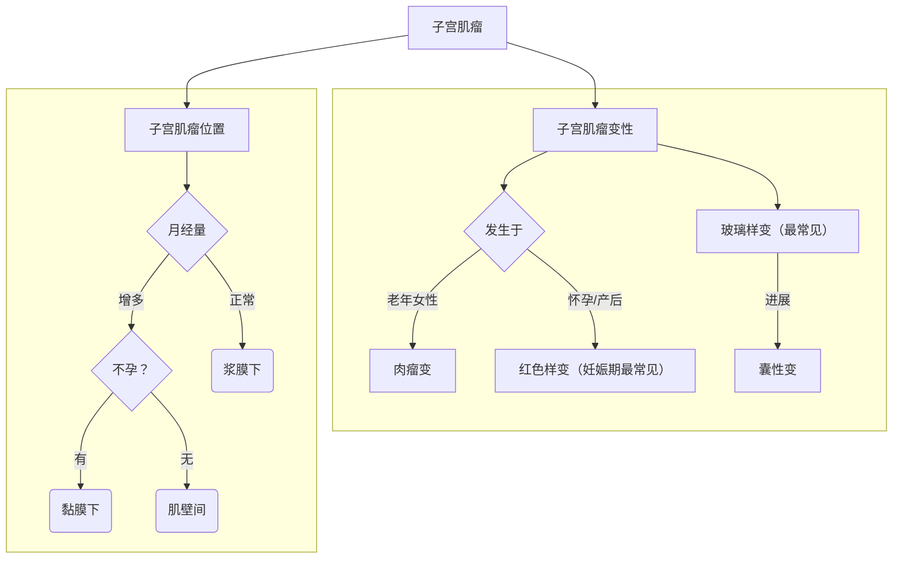

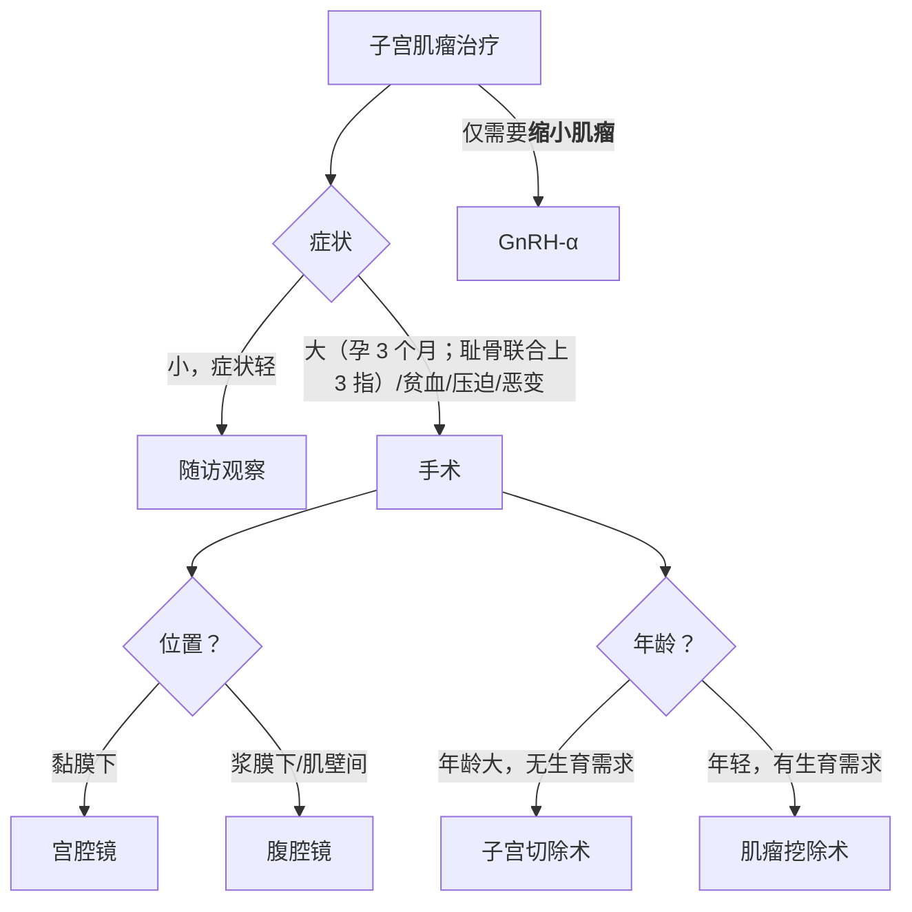

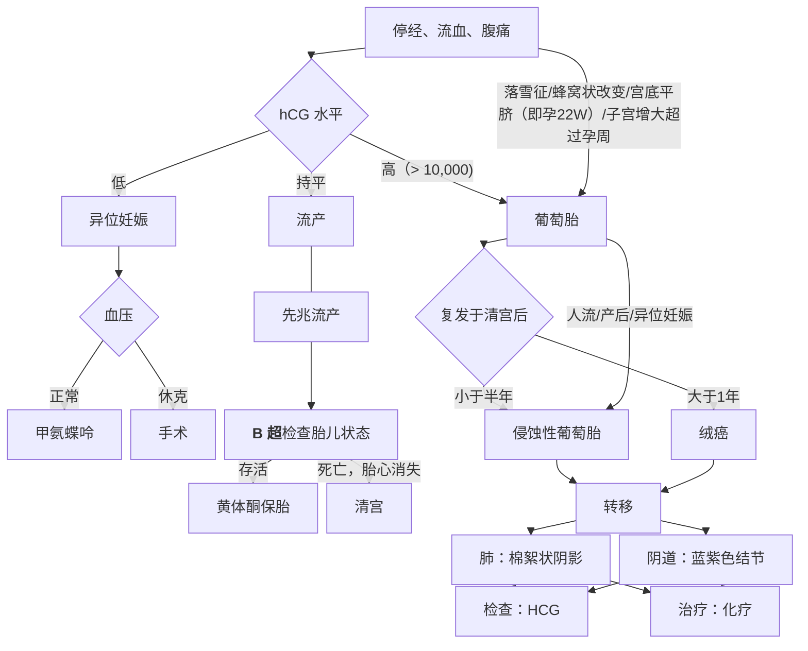

> [!NOTE] 绒癌没有绒毛
> “三无”——无绒毛、无结构、无间质。

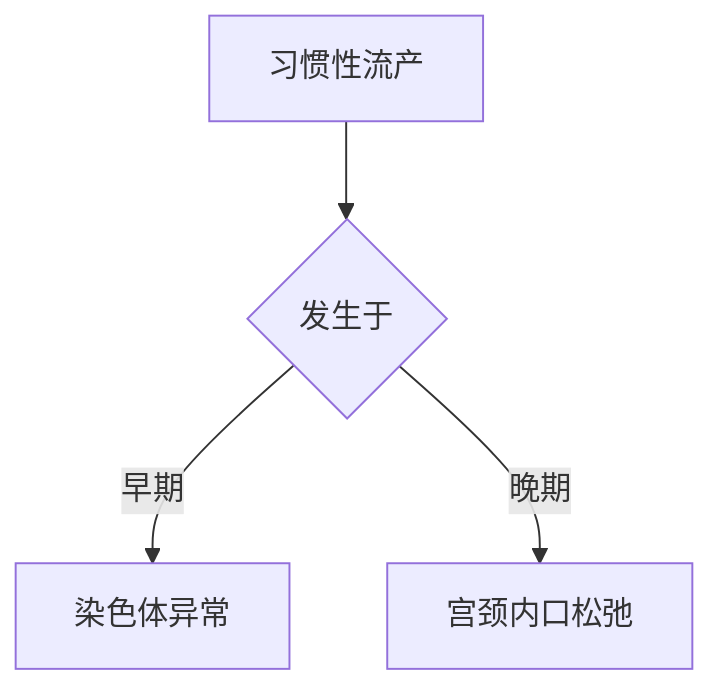

### 宫颈癌

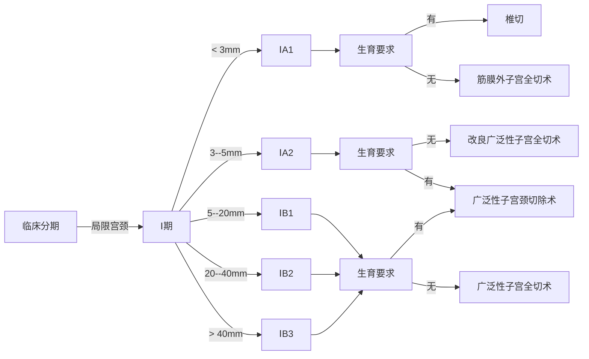

老年女性，高血压，糖尿病，子宫内膜厚且不规则增厚 --> 子宫内膜癌

## 卵巢

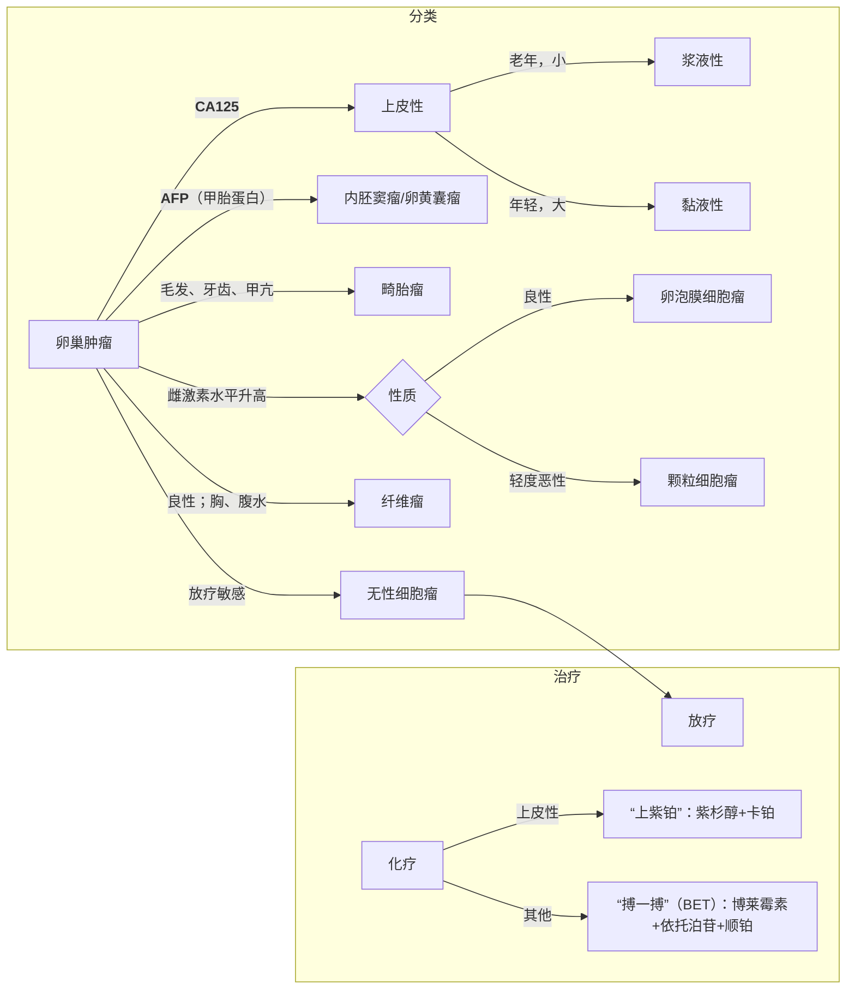

卵巢肿瘤类型：

- 上皮性（==CA125==）：
    - 浆液性：双侧、单房
    - 黏液性：单侧、多房，**巨大**

1. 卵泡膜细胞瘤：良性
1. 颗粒细胞瘤：卵泡膜细胞瘤的轻度恶性形式；分泌雌激素
    - 绝经前：月经紊乱
    - 绝经后：再次出血
1. 无性细胞瘤：放疗敏感
1. ==卵巢纤维瘤==：{}盆腔实质性肿块；月经正常；伴胸、腹水（淡黄色滤出液）{}
1. 恶性畸胎瘤：
    - 见分化组织
    - 卵巢**皮样囊肿**：可发生囊肿蒂扭转，表现为突发剧烈腹痛，**不可穿刺**

卵巢囊肿：

1. 黄素囊肿：可能伴随葡萄胎；无需处理

## 妊娠期高血压

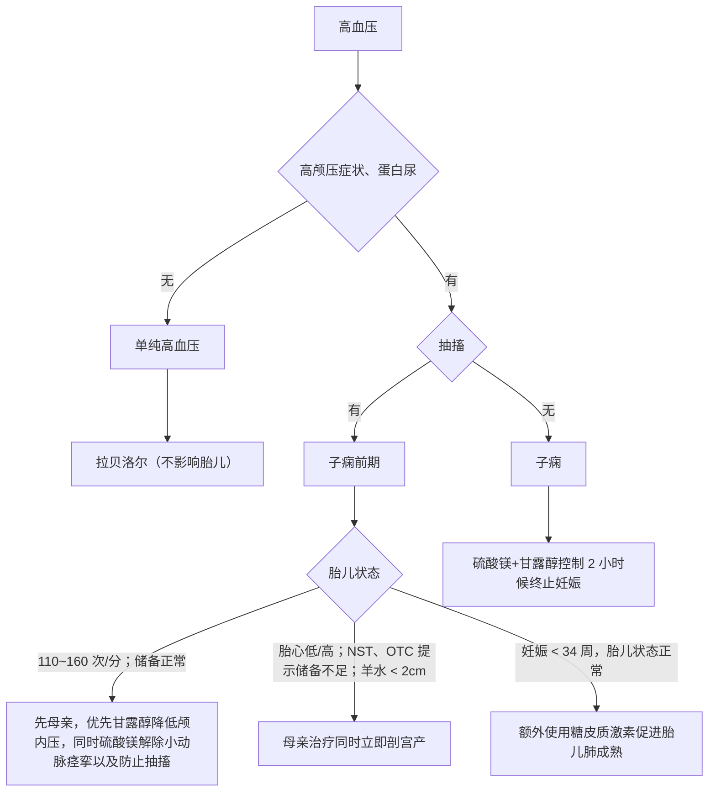

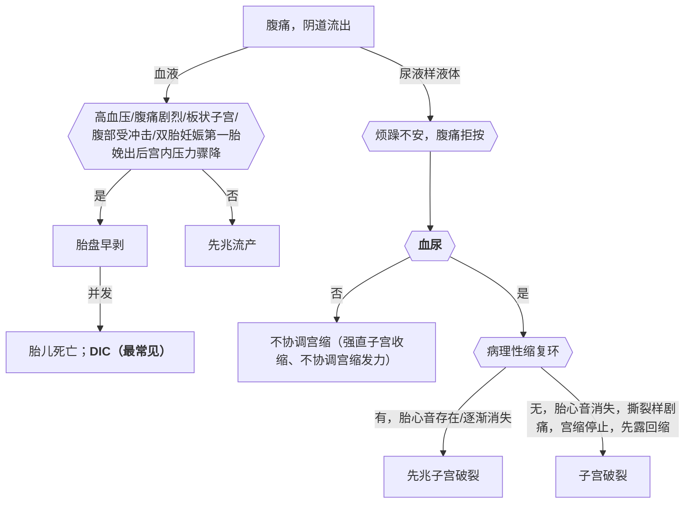

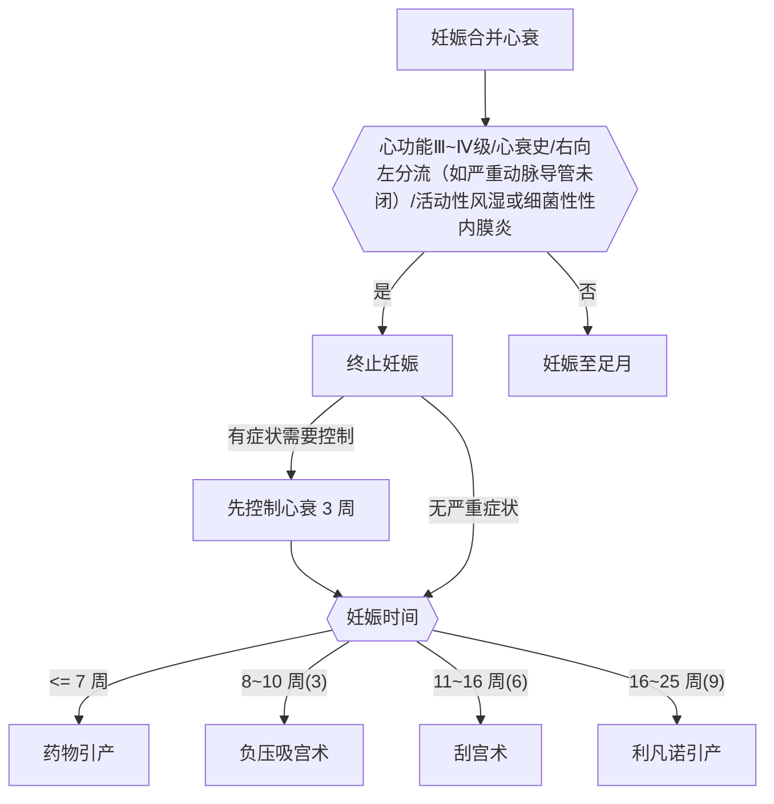

## 产程

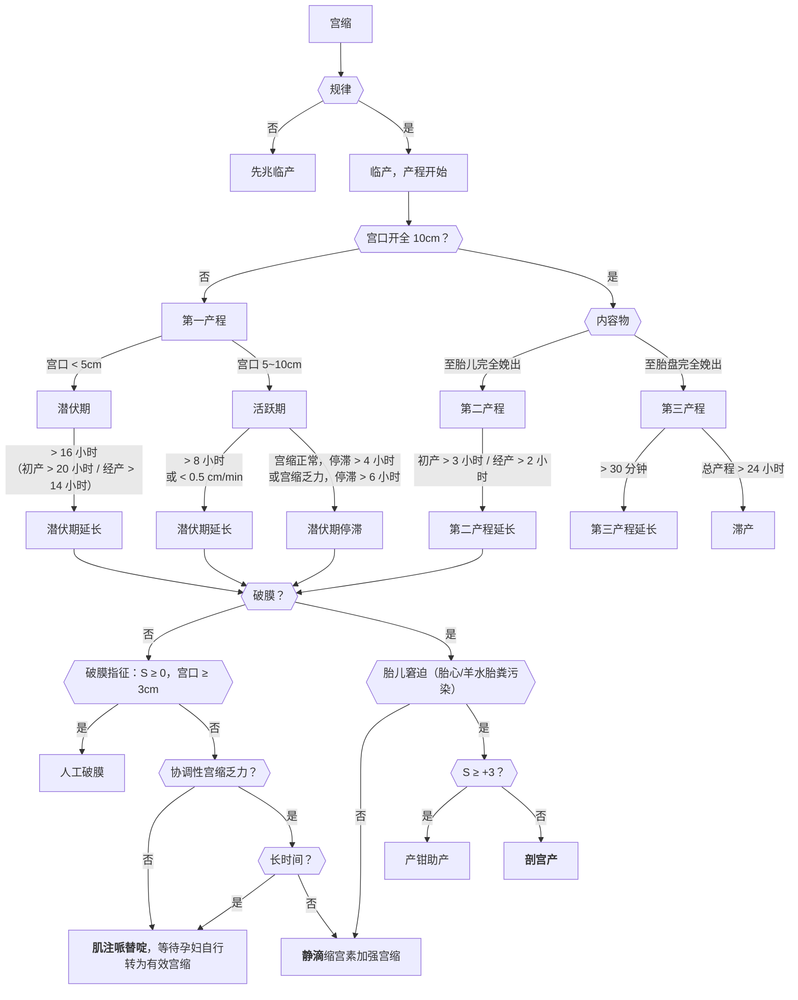

## 产后出血

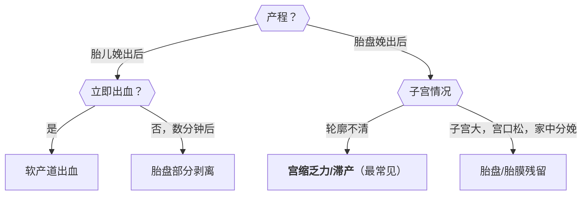

