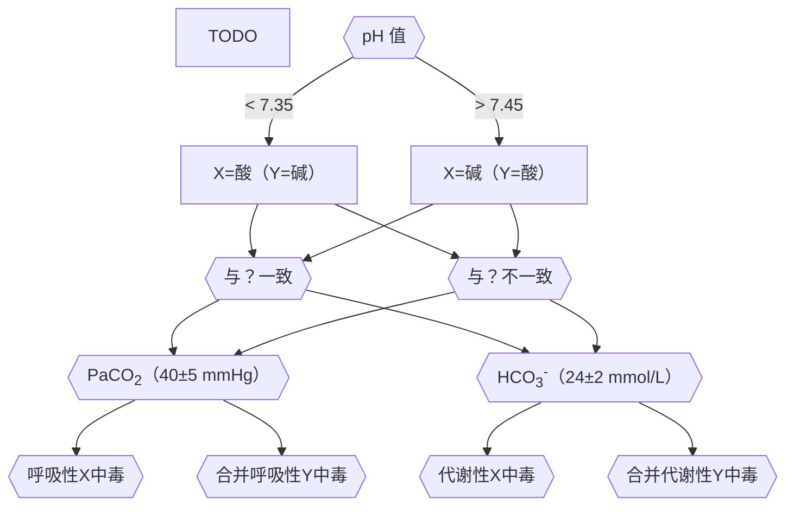

<!--more-->

## 血气分析

```mermaid
flowchart TD
    todo[TODO]
    ph{{pH 值}}
    paco2{{"`PaCO<sub>2</sub>（40±5 mmHg）`"}}
    hco3{{"`HCO<sub>3</sub><sup>-</sup>（24±2 mmol/L）`"}}

    ph -- "< 7.35" --> a[X=酸（Y=碱）]
    ph -- "> 7.45" --> b[X=碱（Y=酸）]

    a --> yizhi{{与？一致}}
    b --> yizhi

    yizhi --> paco2 --> xr{{呼吸性X中毒}}
    yizhi --> hco3 --> xm{{代谢性X中毒}}

    a --> buyizhi{{与？不一致}}
    b --> buyizhi

    buyizhi --> paco2 --> hr{{合并呼吸性Y中毒}}
    buyizhi --> hco3 --> hm{{合并代谢性Y中毒}}
```
