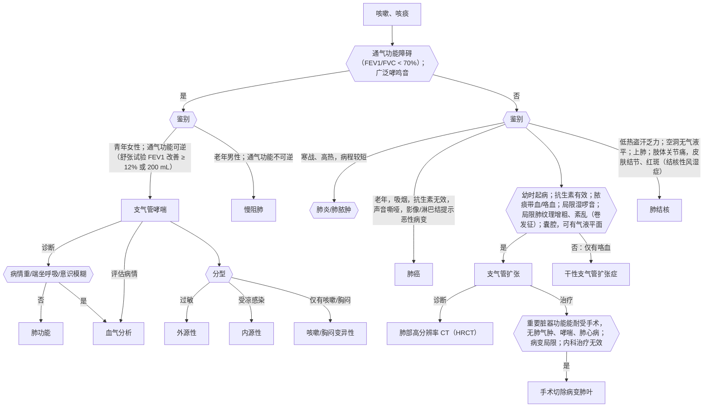
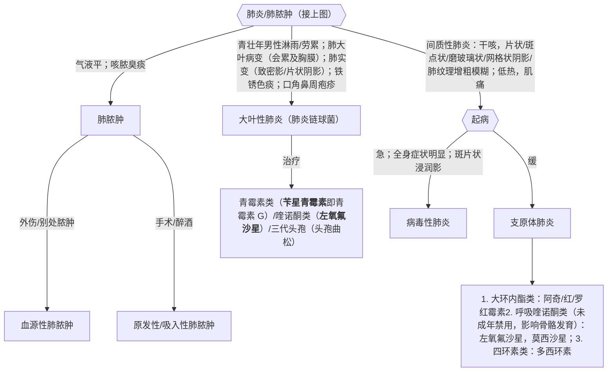
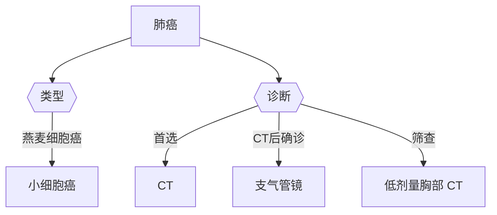
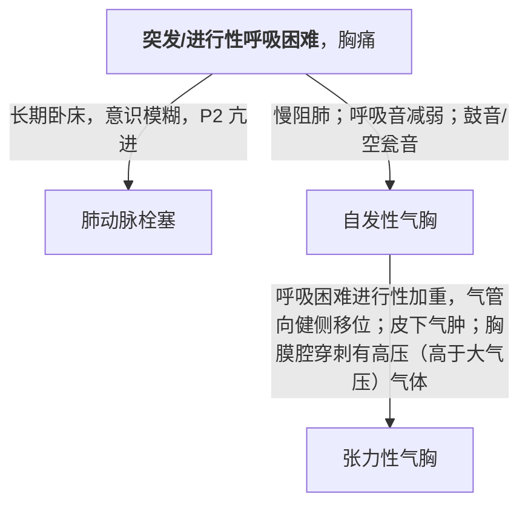
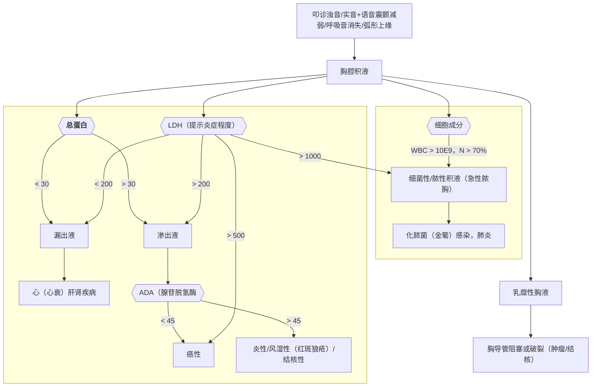

<!--more-->

## 慢阻肺和支气管哮喘

```mermaid
flowchart TD
    st[咳嗽、咳痰] --> fev1{{通气功能障碍\n（FEV1/FVC < 70%）；\n广泛哮鸣音}} -- 是 --> jb{{鉴别}}

    jb -- "青年女性；通气功能可逆（舒张试验 FEV1 改善 ≥ 12% 或 200 mL）" --> d1[支气管哮喘]
    jb -- 老年男性；通气功能不可逆 --> d2[慢阻肺]

    d1 -- 诊断 --> bq{{病情重/端坐呼吸/意识模糊}}

    bq -- 否 --> dg1[肺功能]
    bq -- 是 --> dg2[血气分析]

    d1 -- 评估病情 --> dg2

    d1 --> by{{分型}}

    by -- 过敏 --> xc1[外源性]
    by -- 受凉感染 --> xc2[内源性]
    by -- 仅有咳嗽/胸闷 --> xc3[咳嗽/胸闷变异性]

    %% 支扩
    fev1 -- 否 --> gr{{鉴别}}

    gr -- 寒战、高热，病程较短 --> yz{{肺炎/肺脓肿}}

    gr -- 老年，吸烟，抗生素无效，声音嘶哑，影像/淋巴结提示恶性病变 ---> 肺癌

    gr --> zktz{{幼时起病；抗生素有效；脓痰带血/咯血；局限湿啰音；局限肺纹理增粗、紊乱（卷发征）；囊腔，可有气液平面}}
    zktz -- 是 --> zk[支气管扩张]
    zktz -- 否：仅有咯血 --> gxzk[干性支气管扩张症]
    zk -- 诊断 --> ct[肺部高分辨率 CT（HRCT）]
    zk -- 治疗 --> sugzz{{重要脏器功能能耐受手术，无肺气肿、哮喘、肺心病；病变局限；内科治疗无效}}
    sugzz -- 是 --> sug[手术切除病变肺叶]

    gr -- 低热盗汗乏力；空洞无气液平；上肺；肢体关节痛，皮肤结节、红斑（结核性风湿症） --> fjh[肺结核]
```

## 肺炎和肺脓肿

```mermaid
flowchart TD
    yz{{肺炎/肺脓肿（接上图）}} -- 气液平；咳脓臭痰 --> fnz[肺脓肿]
    yz -- 青壮年男性淋雨/劳累；肺大叶病变（会累及胸膜）；肺实变（致密影/片状阴影）；铁锈色痰；口角鼻周疱疹 --> dyxfy[大叶性肺炎（肺炎链球菌）]
    dyxfy -- 治疗 --> t1["`青霉素类（**苄星青霉素**即青霉素 G）/喹诺酮类（**左氧氟沙星**）/三代头孢（头孢曲松）`"]

    yz -- 间质性肺炎：干咳，片状/斑点状/磨玻璃状/网格状阴影/肺纹理增粗模糊；低热，肌痛 --> qb{{起病}}
    qb -- 急；全身症状明显；斑片状浸润影 --> bd[病毒性肺炎]
    qb -- 缓 --> zyt[支原体肺炎] --> zyty[1. 大环内酯类：阿奇/红/罗红霉素2. 呼吸喹诺酮类（未成年禁用，影响骨骼发育）：左氧氟沙星，莫西沙星；3. 四环素类：多西环素]

    fnz -- 外伤/别处脓肿 ---> xyxfnz[血源性肺脓肿]
    fnz -- 手术/醉酒 ---> xrxfnz[原发性/吸入性肺脓肿]
```

```mermaid
flowchart TD
    fa[肺癌] --> lx{{类型}} -- 燕麦细胞癌 --> 小细胞癌

    fa[肺癌] --> dg{{诊断}} -- 首选 --> CT
    dg -- CT后确诊 --> 支气管镜
    dg -- 筛查 --> djlct[低剂量胸部 CT]
```

## 肺血栓栓塞症

```mermaid
flowchart TD
    input["`**突发/进行性呼吸困难**，胸痛`"]

    input -- 长期卧床，意识模糊，P2 亢进 --> d1[肺动脉栓塞]
    input -- 慢阻肺；呼吸音减弱；鼓音/空瓮音 --> d2[自发性气胸]

    d2 -- 呼吸困难进行性加重，气管向健侧移位；皮下气肿；胸膜腔穿刺有高压（高于大气压）气体 --> 张力性气胸
```

诊断选 CTPA。

## 胸腔积液

```mermaid
flowchart TD
    叩诊浊音/实音+语音震颤减弱/呼吸音消失/弧形上缘 --> xj[胸腔积液]

    xj -----> rm[乳糜性胸液] --> d4[胸导管阻塞或破裂（肿瘤/结核）]

    subgraph sg1[" "]
        xbcf{{细胞成分}}
        xbcf -- WBC > 10E9，N > 70% --> nx[细菌性/脓性积液（急性脓胸）] --> hn[化脓菌（金葡）感染，肺炎]
    end
    xj --> xbcf

    %% 生化
    subgraph sg2[" "]
        zdb{{"`**总蛋白**`"}}
        ldh{{LDH（提示炎症程度）}}

        zdb -- < 30 --> ly[漏出液]
        zdb -- > 30 ---> sy[渗出液]

        ly --> d1[心（心衰）肝肾疾病]

        sy --> ada{{ADA（腺苷脱氢酶}}
        ada -- < 45 --> d2[癌性]
        ada -- > 45 --> d3[炎性/风湿性（红斑狼疮）/结核性]

        ldh -- < 200 ---> ly
        ldh -- > 200 --> sy
        ldh -- > 500 --> d2
    end
    xj --> zdb & ldh
    ldh -- > 1000 --> nx
```

