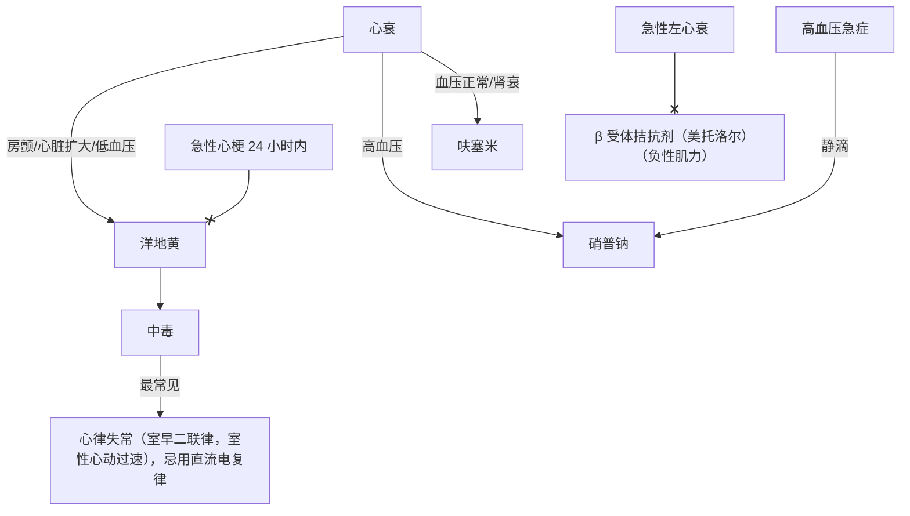
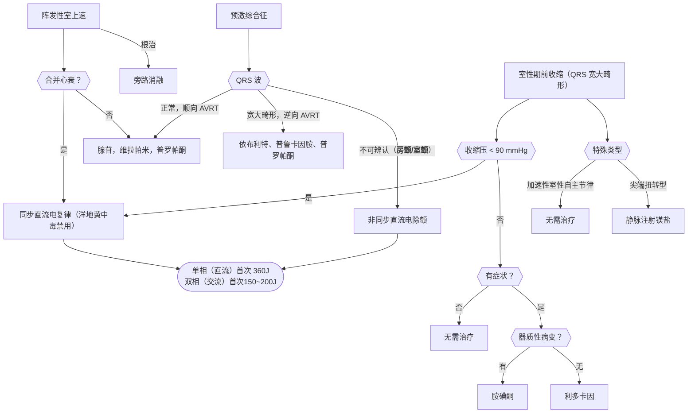
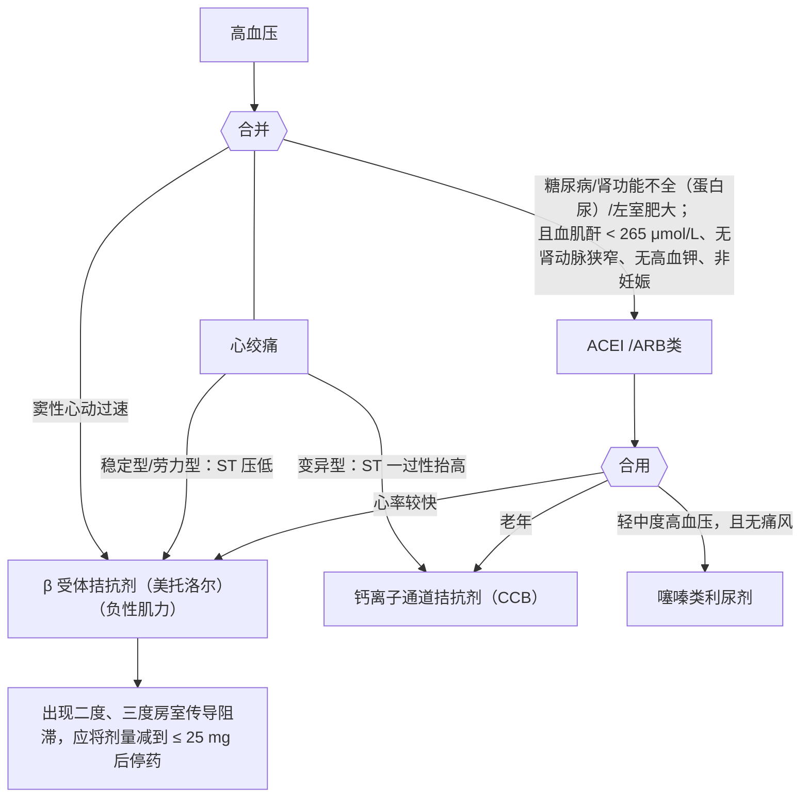

<!--more-->

## 心衰




- 血压低，我电击（室颤同步，其余非同步)
- 看到缓慢用阿姨 (阿托品异丙肾) 
- 看到室性利多安（利多卡因胺碘酮) 
- 室上速，腺帕酮 （腺苷，维拉帕米，普罗帕酮)
- 普通预激同室上（腺帕酮)
- 旁路预激要消融 (射频消融)


起搏器 》 心房充盈，释放心房钠尿肽 》 外周血管舒张 》 血压降低



## 高血压

```txt
1234 2234 3444
```



